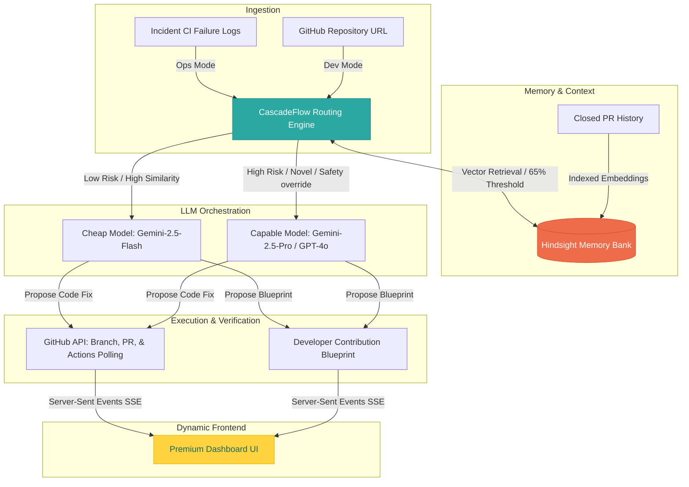

# 🌀 Continuum: AI-Powered Self-Healing & Open-Source Contributor Platform

Continuum is a production-hardened, enterprise-grade engineering memory and automated healing platform. It addresses one of the software industry's costliest inefficiencies: **engineering teams solving the same incidents, bugs, and configuration failures repeatedly because organizational knowledge vanishes inside archived chat channels and forgotten pull requests.**

Continuum functions as a closed-loop engineering memory system:
1. **Self-Healing Loop (Ops Mode)**: Automatically detects CI pipeline and integration failures, queries historical resolved memories in Hindsight, decides on the most cost-efficient LLM tier via CascadeFlow, checks out a git branch, repairs code, issues a Pull Request, polls CI/CD for validation, and vectors the final resolution.
2. **Contributor Hub (Dev Mode)**: Streamlines open-source onboarding. By scanning public repositories, vector-indexing PR history, and running CascadeFlow evaluation against open issues, it generates highly context-aware, step-by-step contribution blueprints for developers.

---

## 📐 Platform Architecture

Continuum couples SSE telemetry, vector similarity search, dynamic model tiering, and active git operations into a unified workflow.



---

## 🧠 Core System Modules

### 1. CascadeFlow Routing Engine
To guarantee enterprise cost-efficiency, the **CascadeFlow Routing Engine** prevents runaway API usage by dynamically selecting the optimal LLM tier (Cheap vs. Capable) using Hindsight similarity scores and structural guardrails:

*   **Risk Profile Analyzer**: Checks target file paths against configured `high_risk_patterns` (e.g., `auth/`, `.github/workflows/`, security configs). Any overlap triggers an immediate safety override, bypassing memory matching to route straight to the **Capable Model** (Gemini 2.5 Pro / GPT-4o).
*   **Confidence Calculator**: Calculates a confidence score between `0.0` and `1.0` based on:
    *   **Prior Verified Memory**: A match above `80%` similarity adds `+0.45` confidence; a moderate match adds `+0.30`.
    *   **Prior Hypothesis Memory**: Adds `+0.15` confidence.
    *   **Prior Refuted Memory**: Lowers confidence by `-0.25` (encourages exploring alternative fixes).
    *   **Complexity Factors**: Extremely large logs (>8,000 characters) lower confidence by `-0.10`; multi-file modifications (>2 files) lower confidence by `-0.10`.
*   **Tier Enforcement**: If the confidence score meets or exceeds the **75% threshold**, the incident is routed to the **Cheap Model** (Gemini 2.5 Flash), reducing execution costs by up to 95%. If confidence falls below 75%, it escalates to the **Capable Model**.

---

### 2. Hindsight Memory Bank
An active memory repository that keeps track of engineering histories. It integrates with Hindsight vector storage (or falls back to an internal in-memory key-value cache when Hindsight is unavailable) to record:
*   **Hypothesis Memories**: Fixes currently undergoing verification in CI.
*   **Verified Memories**: Confirmed fixes that successfully repaired the codebase (their similarity scores are actively queried to resolve future incidents).
*   **Refuted Memories**: Proposed code fixes that failed CI checks. Continuum tracks these to prevent repeating incorrect solutions.
*   **Superseded Memories**: Prior fixes replaced by a superior or more general patch.

---

### 3. Self-Healing Loop (Ops Mode)
A state-machine that operates autonomously across these steps:
1.  **Detected**: Ingests incident telemetry containing branch information, commit SHA, error logs, and failure signatures.
2.  **Recall**: Queries the Hindsight Memory Bank to pull similar past failures.
3.  **Routing**: Runs CascadeFlow evaluation to determine the routing tier and saves the rationale.
4.  **Investigating**: Invokes the selected LLM to construct a precise patch. The model returns a structured JSON payload outlining target file names, replacement lines, and code additions/removals.
5.  **Fix Proposed**: Connects to the GitHub API, spins up a dedicated fix branch (`continuum-fix/inc-<uuid>`), applies the changes, and submits a Pull Request.
6.  **Verifying**: Polls GitHub Actions workflow runs.
    *   **Success**: The incident is marked as `Verified`, the PR is left ready for merge, and the fix is indexed as a `Verified Memory`.
    *   **Failure**: The patch is marked as a `Refuted Memory`. The incident escalates to the Capable Tier for a second iteration.

---

### 4. Contributor Hub (Dev Mode)
Designed to lower barriers for open-source contributors:
*   **URL Ingestion**: Parses public GitHub repo URLs, extracting the owner and repository.
*   **Context Parsing**: Extracts open issues and scans closed Pull Requests.
*   **PR History Vectorization**: Automatically uploads and vectors closed PRs into the Hindsight Memory Bank.
*   **Issue Similarity Evaluation**: Evaluates open issues against closed PRs. If a match is found, CascadeFlow routes to the Cheap tier to summarize the historical fix. If the issue is novel, the Capable tier performs complex architectural design.
*   **Blueprint Generation**: Compiles an actionable contribution markdown blueprint detailing:
    *   Similar past PRs for reference.
    *   Exact file paths to edit.
    *   Implementation guidance and code structure.
    *   Local test suite verification commands.

---

## 🛠️ Technology Stack

### Backend Services
*   **Runtime & Language**: Node.js (v18+), TypeScript, Express
*   **Database Client**: Supabase JS SDK (PostgreSQL pgvector ready)
*   **Git Integration**: Octokit REST and Octokit Actions REST client
*   **LLM Orchestrators**: `@cascadeflow/core` for speculative execution, Google Gemini Node SDK (Gemini 2.5 Flash/Pro), OpenAI SDK fallback.
*   **Telemetry Stream**: Server-Sent Events (SSE) for sub-second dashboard updates.

### Frontend Dashboard
*   **Framework & Bundler**: React 18, Vite, TypeScript
*   **Design Language**: Custom premium Vanilla CSS (playful, high-trust, responsive grid, tactile widgets).
*   **Icons**: Lucide React

---

## 📁 Repository Structure & Registry

```
Hackarambh/
├── backend/
│   ├── src/
│   │   ├── config/
│   │   │   └── index.ts          # Integrates environment config (Gemini, Supabase, Github tokens)
│   │   ├── db/
│   │   │   ├── index.ts          # Core database adapter with memory fallback logic
│   │   │   └── schema.sql        # Database schema script for Supabase / PostgreSQL
│   │   ├── routes/
│   │   │   └── api.ts            # Core API endpoints & SSE Event emitter (/api/events)
│   │   ├── services/
│   │   │   ├── contributor.ts    # Manages issue scanning, vector indexing, & contribution blueprints
│   │   │   ├── github.ts         # Integrates GitHub API operations (branches, files, PRs)
│   │   │   ├── hindsight.ts      # Vectors and indexes memories and searches similarities
│   │   │   ├── investigator.ts   # Runs the self-healing state machine
│   │   │   ├── routing.ts        # Computes CascadeFlow routing decisions and file check overrides
│   │   │   └── verification.ts   # Polls GitHub Actions workflow runs for PR verification
│   │   └── index.ts              # Express Server entrypoint
│   └── package.json
└── frontend/
    ├── src/
    │   ├── pages/
    │   │   ├── Dashboard.tsx     # High-fidelity dashboard interface (Ops and Dev panels)
    │   │   └── LandingPage.tsx   # Portal entrypoint containing project insights
    │   ├── App.tsx               # Main React router and layout container
    │   ├── index.css             # Unified CSS tokens, animations, and typography
    │   └── main.tsx              # React mounting root
    └── package.json
```

---

## 💾 Database Schema

 continuum utilizes PostgreSQL to track installations, repositories, incidents, routing decisions, memory mirrors, and audit logs. Apply this schema in your Supabase SQL Editor:

```sql
-- Schema definition for Continuum Engineering Memory Platform

-- 1. Installations Table (Tracks GitHub App integration states)
CREATE TABLE IF NOT EXISTS installations (
  id BIGINT PRIMARY KEY, -- GitHub App Installation ID
  account_id BIGINT NOT NULL,
  account_name TEXT NOT NULL,
  status TEXT NOT NULL DEFAULT 'active',
  created_at TIMESTAMP WITH TIME ZONE DEFAULT timezone('utc'::text, now()) NOT NULL,
  updated_at TIMESTAMP WITH TIME ZONE DEFAULT timezone('utc'::text, now()) NOT NULL
);

-- 2. Repositories Table (Tracks settings for monitored codebases)
CREATE TABLE IF NOT EXISTS repositories (
  id BIGINT PRIMARY KEY, -- GitHub Repository ID
  installation_id BIGINT REFERENCES installations(id) ON DELETE CASCADE,
  name TEXT NOT NULL,
  full_name TEXT NOT NULL,
  tracked_branches TEXT[] DEFAULT '{"main", "master"}'::TEXT[] NOT NULL,
  high_risk_patterns TEXT[] DEFAULT '{"auth/", ".github/workflows/"}'::TEXT[] NOT NULL,
  direct_push_mode BOOLEAN DEFAULT false NOT NULL,
  created_at TIMESTAMP WITH TIME ZONE DEFAULT timezone('utc'::text, now()) NOT NULL,
  updated_at TIMESTAMP WITH TIME ZONE DEFAULT timezone('utc'::text, now()) NOT NULL
);

-- 3. Incidents Table (Manages individual self-healing tickets)
CREATE TABLE IF NOT EXISTS incidents (
  id UUID PRIMARY KEY DEFAULT gen_random_uuid(),
  repository_id BIGINT REFERENCES repositories(id) ON DELETE CASCADE NOT NULL,
  state TEXT NOT NULL DEFAULT 'detected', -- detected, recall, routing, investigating, fix_proposed, verifying, verified, refuted, escalated
  branch TEXT NOT NULL,
  pull_request_number INTEGER,
  commit_sha TEXT NOT NULL,
  error_signature TEXT NOT NULL,
  error_category TEXT NOT NULL,
  log_summary TEXT,
  proposed_fix_sha TEXT,
  created_at TIMESTAMP WITH TIME ZONE DEFAULT timezone('utc'::text, now()) NOT NULL,
  updated_at TIMESTAMP WITH TIME ZONE DEFAULT timezone('utc'::text, now()) NOT NULL
);

-- 4. Routing Decisions Table (Stores CascadeFlow evaluations)
CREATE TABLE IF NOT EXISTS routing_decisions (
  id UUID PRIMARY KEY DEFAULT gen_random_uuid(),
  incident_id UUID REFERENCES incidents(id) ON DELETE CASCADE NOT NULL,
  tier TEXT NOT NULL, -- cheap, capable
  confidence_score DOUBLE PRECISION NOT NULL,
  explanation TEXT NOT NULL,
  escalated BOOLEAN DEFAULT false NOT NULL,
  escalation_reason TEXT,
  created_at TIMESTAMP WITH TIME ZONE DEFAULT timezone('utc'::text, now()) NOT NULL
);

-- 5. Memory Mirrors Table (Mirrors Hindsight index states with metadata)
CREATE TABLE IF NOT EXISTS memory_mirrors (
  id UUID PRIMARY KEY DEFAULT gen_random_uuid(),
  incident_id UUID REFERENCES incidents(id) ON DELETE CASCADE NOT NULL,
  hindsight_doc_id TEXT NOT NULL,
  state TEXT NOT NULL DEFAULT 'hypothesis', -- hypothesis, verified, refuted, superseded
  similarity_score DOUBLE PRECISION NOT NULL,
  verification_evidence_url TEXT,
  superseded_by UUID REFERENCES memory_mirrors(id) ON DELETE SET NULL,
  created_at TIMESTAMP WITH TIME ZONE DEFAULT timezone('utc'::text, now()) NOT NULL
);

-- 6. Audit Logs Table (Detailed actions ledger for security)
CREATE TABLE IF NOT EXISTS audit_logs (
  id UUID PRIMARY KEY DEFAULT gen_random_uuid(),
  repository_id BIGINT REFERENCES repositories(id) ON DELETE CASCADE NOT NULL,
  incident_id UUID REFERENCES incidents(id) ON DELETE SET NULL,
  action TEXT NOT NULL, -- commit_fix, post_badge, open_pr, routing_escalation, recall_memories, verify_success, verify_failure
  description TEXT NOT NULL,
  created_at TIMESTAMP WITH TIME ZONE DEFAULT timezone('utc'::text, now()) NOT NULL
);

-- Updated_at triggers
CREATE OR REPLACE FUNCTION update_updated_at_column()
RETURNS TRIGGER AS $$
BEGIN
   NEW.updated_at = now();
   RETURN NEW;
END;
$$ language 'plpgsql';

CREATE OR REPLACE TRIGGER update_installations_updated_at BEFORE UPDATE
ON installations FOR EACH ROW EXECUTE PROCEDURE update_updated_at_column();

CREATE OR REPLACE TRIGGER update_repositories_updated_at BEFORE UPDATE
ON repositories FOR EACH ROW EXECUTE PROCEDURE update_updated_at_column();

CREATE OR REPLACE TRIGGER update_incidents_updated_at BEFORE UPDATE
ON incidents FOR EACH ROW EXECUTE PROCEDURE update_updated_at_column();
```

---

## ⚙️ Environment Configuration

Prepare a `backend/.env` file in the backend directory containing the following:

```ini
PORT=3001
SUPABASE_URL=https://your-project.supabase.co
SUPABASE_KEY=your-supabase-anon-key

# GitHub Token for Live API integration (required to execute real code commits and PRs)
GITHUB_TOKEN=ghp_yourGitHubAccessToken

# Hindsight LLM Integration Config
HINDSIGHT_URL=http://127.0.0.1:8888
HINDSIGHT_LLM_PROVIDER=gemini
HINDSIGHT_LLM_API_KEY=AQ.yourGeminiAPIKey
HINDSIGHT_LLM_MODEL=gemini-2.5-flash

# CascadeFlow Routing Configuration
CASCADEFLOW_MODE=enforce
CASCADEFLOW_BUDGET=0.50

# Simulation Mode Toggle (Set to true to use mock incidents for local demo testing)
SIMULATION_MODE=true
```

---

## 🚀 Setup & Execution Guide

### 1. Database Provisioning
Ensure you have a Supabase / PostgreSQL instance running and execute the `schema.sql` code in the database editor to construct all core tables.

### 2. Booting the Backend Server
```bash
cd backend
npm install
npm run build # Validates TypeScript compile
npm run start # Or `npm run dev` to watch changes using tsx
```
*The API gateway is exposed at `http://localhost:3001`.*

### 3. Booting the Frontend Client
```bash
cd frontend
npm install
npm run dev
```
*The Vite application runs at `http://localhost:5173`.*

