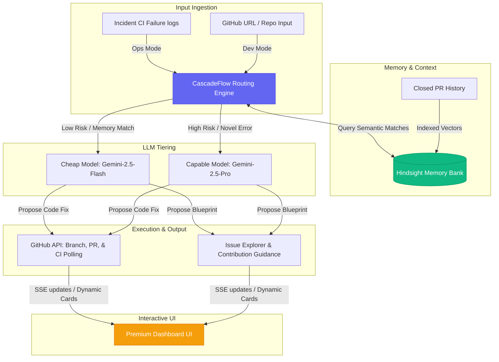

# 🌀 Continuum Platform: Comprehensive Progress Context

This document provides the complete context of what has been built for the **Continuum Self-Healing & OSS Contributor Platform** from its inception to its current production-ready state.

---

## 📐 Platform Architecture

Continuum is a dual-purpose engineering platform designed to automate incident resolution (Ops Mode) and guide open-source contribution (Dev Mode) using a unified intelligence pipeline:



---

## 📊 Summary of Milestones Built

| Milestone / Capability | Status | Description |
| :--- | :---: | :--- |
| **1. Database Schema & Supabase Setup** | **100% Complete** | Persistent and memory-fallback storage tracking repos, incidents, audit logs, and memories. |
| **2. Dual-Tier LLM Orchestration** | **100% Complete** | Integration with OpenAI and Google Gemini APIs supporting dynamic model tier selection. |
| **3. CascadeFlow Routing Engine** | **100% Complete** | Similarity-based cost and capabilities routing utilizing recall thresholds. |
| **4. Hindsight Memory & Recall** | **100% Complete** | Vector database client indexing resolved histories as verified memory ledger. |
| **5. Live GitHub REST & Actions API** | **100% Complete** | End-to-end branch creation, code modification, PR updates, and actions polling. |
| **6. Premium Dashboard Frontend** | **100% Complete** | Dual-mode Ops/Dev web interface with loading telemetry steps, log terminals, and blueprint visualizers. |
| **7. URL Ingestion & Error Safety** | **100% Complete** | Regex URL parsing, strict mock fallback gates, and rate-limit diagnostics. |

---

## 🗂️ File Registry & Code Structure

The workspace is split into two clean directories:

```
Hackarambh/
├── backend/
│   ├── src/
│   │   ├── config/
│   │   │   └── index.ts        # Loads environment settings (Gemini, Supabase, Github)
│   │   ├── db/
│   │   │   ├── index.ts        # Supabase client wrapper & local MemoryStore fallback
│   │   │   └── schema.sql      # Database DDL statements
│   │   ├── routes/
│   │   │   └── api.ts          # REST endpoints & SSE Event emitter (/api/events)
│   │   ├── services/
│   │   │   ├── contributor.ts  # Fetches issues/PRs, indexes PRs, runs Dev routing & blueprints
│   │   │   ├── github.ts       # Integrates branch creation, file commits, & PR creations
│   │   │   ├── hindsight.ts    # Manages vector initialization, document inserts, & similarity searches
│   │   │   ├── investigator.ts # Manages self-healing lifecycle state machine
│   │   │   ├── routing.ts      # Computes CascadeFlow routing decisions
│   │   │   └── verification.ts # Polls GitHub Actions workflow status to verify fixes
│   │   └── index.ts            # Bootstraps Express backend server
│   └── package.json
└── frontend/
    ├── src/
    │   ├── pages/
    │   │   ├── Dashboard.tsx   # Premium Unified UI Dashboard (Ops and Dev Modes)
    │   │   └── progress.md     # Project progress logs
    │   ├── App.css
    │   ├── index.css           # Curated CSS styling system (colors, layout rules, scrollbars)
    │   └── main.tsx
    └── package.json
```

---

## 🛠️ Operational Deep-Dive

### 1. Ops Mode (Incident Auto-Healing)
- **Trigger**: The backend receives a webhook notification or manual trigger indicating a pipeline check failed (e.g. `AssertionError: expected 91 to equal 90`).
- **Recall & Route**: Hindsight reviews similar past incidents. If similarity exceeds **65%**, CascadeFlow assigns a `cheap` model tier (Gemini Flash). Otherwise, it delegates to `capable` (Gemini Pro).
- **Repair**: The investigator LLM is prompt-steered to yield a JSON block containing the target file modifications.
- **Commit**: The backend creates a fix branch, edits the file code directly on GitHub, and opens a Pull Request.
- **Verify**: The verification service polls the repository's GitHub Actions workflow runs. If it succeeds, the incident transitions to `verified`, and the fix is stored in Hindsight as a verified memory. If it fails, the system automatically escalates to the `capable` tier for attempt 2.

### 2. Dev Mode (OSS Contributor Hub)
- **Ingest & Parse**: Users enter any public GitHub repository URL (e.g., `https://github.com/owner/repo.git`). The backend cleanses protocols, branch strings, and suffixes to retrieve the target owner and repo name.
- **Fetch**: Octokit fetches open issues (excluding pull requests) and recently closed pull requests.
- **Memory Build**: The closed PR history is vectorized and indexed in Hindsight as historical context.
- **CascadeFlow Routing**: The system checks if the open issue resembles any previously closed PRs:
  - If a strong match is found, it routes to `cheap` to summarize.
  - If it is novel, it routes to `capable` for detailed design suggestions.
- **Blueprint Suggestions**: Gemini constructs a step-by-step contribution guide detailing the target files, implementation strategy, and testing procedures.

---

## 🚀 Environment Configuration

To run both modes with live capabilities, set up the following environment configuration inside `backend/.env`:

```ini
PORT=3001
SUPABASE_URL=https://your-project.supabase.co
SUPABASE_KEY=your-supabase-anon-key

# GitHub Integration
# Define GITHUB_TOKEN to enable live repo scanning and avoid API rate limits
GITHUB_TOKEN=ghp_yourPersonalAccessTokenHere

# Hindsight & Gemini LLM Integration
HINDSIGHT_URL=http://127.0.0.1:8888
HINDSIGHT_LLM_PROVIDER=gemini
HINDSIGHT_LLM_API_KEY=AQ.yourGeminiAPIKeyHere
HINDSIGHT_LLM_MODEL=gemini-2.5-flash
CASCADEFLOW_MODE=enforce
CASCADEFLOW_BUDGET=0.50

# Simulation Mode toggles (true = local incident mocks enabled)
SIMULATION_MODE=true
```

---

## 📈 Current Status
Both servers are running locally in parallel:
- **Backend (Express)**: Port `3001` (hot-reloaded with `tsx watch`)
- **Frontend (Vite)**: Port `5173` (hot-reloaded)
- **TypeScript**: 100% verified, clean compilation.
